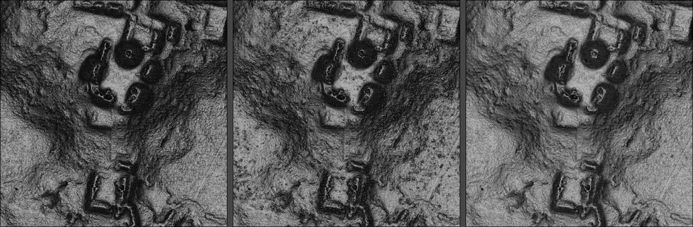
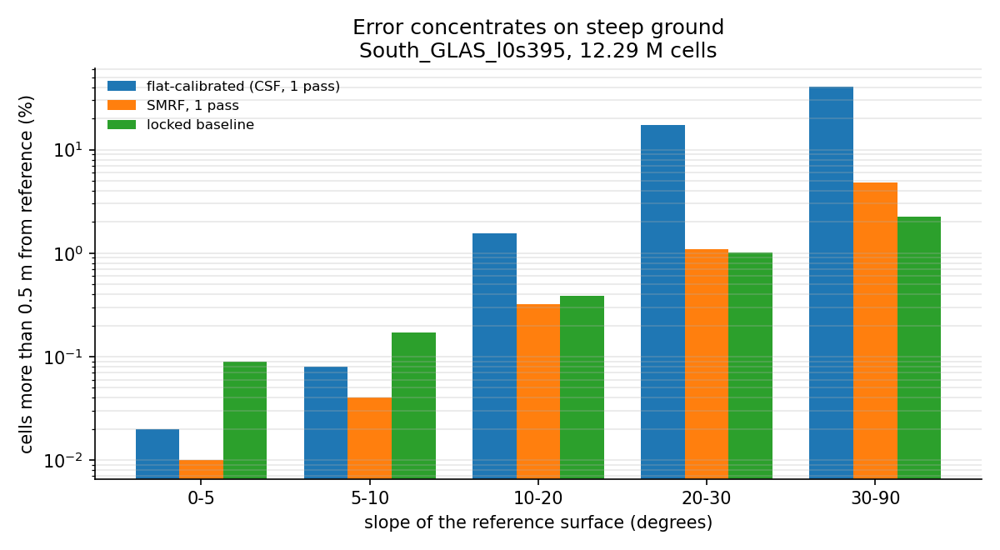
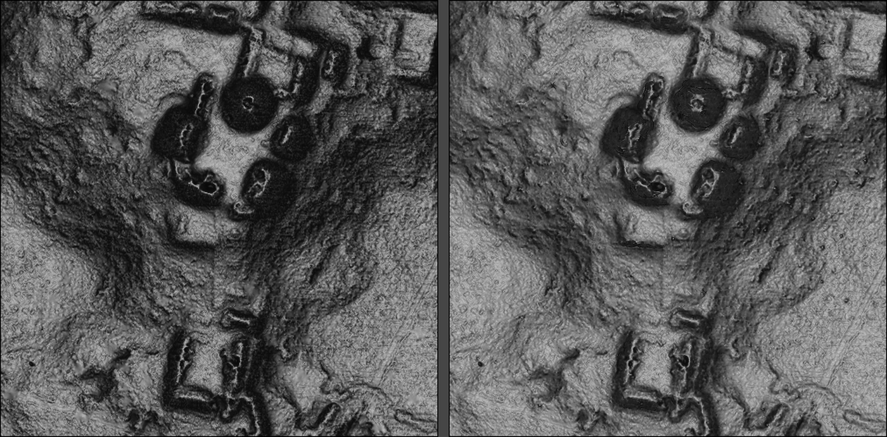
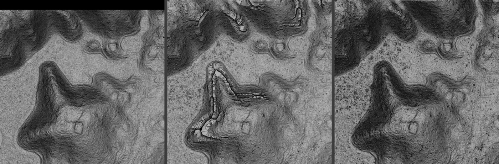

# Replicalm

**Bare-earth lidar processing that reproduces a commercial workflow with open tools.**

Replicalm turns a raw airborne lidar point cloud into two products: a bare-earth
digital elevation model, and the G1 relief visualization archaeologists actually
read. It follows the NCALM workflow described in the Estrada-Belli et al. 2025
supplementary material, using only PDAL, GDAL, NumPy and SciPy — plus the Relief
Visualization Toolbox for the optional image step.

The published method depends on two commercial products: TerraScan for ground
classification, and Golden Surfer for interpolation and rasterization. Without
those licenses the results cannot be reproduced and the method cannot be applied
to new surveys. This closes that gap.



*The Pixoyal group, South_GLAS_l0s395. Left: the original commercial workflow.
Center: Replicalm's locked baseline — note the speckle on the plaza floors.
Right: Replicalm with Clear. Same point cloud, same visualization recipe, all
three normalized over the same extent.*

---

## Results

Tested on `South_GLAS_l0s395` against the reference surface from the original
workflow, over the 12.29 million cells every configuration delivers:

| configuration | RMSE | 20–30° | 30–90° | terracing |
|---|---:|---:|---:|---:|
| tuned on flat windows | 0.3370 m | 17.38% | 40.38% | 9.83% |
| SMRF, single pass | 0.0678 m | 1.10% | 4.85% | 0.85% |
| **locked baseline** | **0.0601 m** | **1.01%** | **2.25%** | **0.26%** |
| reference | — | — | — | 0.00% |

Percentages are cells more than 0.5 m from the reference, by slope band.
Terracing is the share of steep cells whose gradient has collapsed below a
quarter of the reference's — a step where the reference has a continuous face.

Median difference from the reference is **1.5 mm**. Coverage is 99.56% and does
not vary between configurations, so none of the improvement comes from dropping
difficult cells.



## Clear: removing residual vegetation

The baseline surface carries a fine speckle on flat ground that the reference
does not — dark specks where scrub or root mass stopped the pulse above the soil
and the ground filter accepted the return anyway. They read as clutter in the
image, and clutter on a plaza floor is exactly what an archaeologist does not
want to have to discount by eye.

The delivered clouds carry TerraScan's own classification, which supplies a
label. At speck cells, 12.2% of our ground returns are unclassified there
against 0.8% on control ground. Removing exactly those — 3.88% of returns —
takes flat-ground roughness to 1.00× the reference, cuts specks by 94% and
improves RMSE 5.9×. That is the ceiling any fix could reach.

`cleanup.clear()` reaches most of it without TerraScan: demote a ground return
standing more than 0.20 m above the tenth percentile within 0.75 m.

| measure | baseline | Clear |
|---|---:|---:|
| predicts held-out ground returns (MAE) | 0.0492 m | **0.0429 m** |
| returns left below the surface | 8.11% | **4.80%** |
| flat-ground roughness vs reference | 1.26× | **0.99×** |
| error above 20° | 1.86% | **0.29%** |

The first two rows do not reference the archive at all. They ask how well the
surface predicts real measurements it never saw, and whether it floats above
returns that reached lower — a pulse can be stopped early by vegetation but
cannot arrive below the soil. See `src/replicalm/evaluate.py`.



*The Pixoyal group. Left: the original commercial workflow. Right: Replicalm
with Clear. Same point cloud, same visualization recipe, both normalized over
the same extent.*

Clear removes 17.75% of ground returns where the oracle removes 3.88%, and that
collateral softens platform edges slightly. **It is available but is not in the
locked baseline** — adopting it is a deliberate change, not a default.

## Deep: matching the grid to the data

`Deep` is `Clear` plus a cell size derived from the survey's own point density
rather than fixed in advance — `1/√density`, which gives 0.33 m where ground
returns average one every 0.46 m, and a coarser or finer grid on sparser or
denser surveys.

Its target is different from the baseline's. Baseline and `Clear` are aimed at
replication and are scored against the commercial output. `Deep` is aimed at
getting the most from the point cloud and is scored against the returns
themselves. A configuration optimized for one will score differently under the
other by construction, so the two are not directly comparable as better or
worse. Which is the better representation of the ground needs ground truth —
surveyed control points or excavated profiles — that neither workflow has here.

Measured with the grid inside the test (whole blocks of returns withheld, the
surface built without them, then sampled where those returns are):

| cell | median residual | marginal gain | cost vs 0.50 m |
|---|---:|---:|---:|
| 1.00 m | 0.0872 m | — | 0.25× |
| 0.50 m | 0.0803 m | −7.2% | 1.0× |
| **0.33 m** | **0.0787 m** | **−2.0%** | 2.3× |
| 0.25 m | 0.0781 m | −0.8% | 3.9× |

The curve turns at the mean point spacing, which is where `cell_for_density`
puts it. Below that, finer grids buy rendering rather than measurement —
slope and sky-view factor computed without stair-stepping at cell boundaries.

**Deep is an early result**: one window of one tile, and a cell-size rule
resting on a single density measurement. `Clear` was validated on three windows
it was not developed against; `Deep` has had none.

## The finding that shaped this project



*Left: the reference surface. Center: a configuration tuned on flat sample
windows — the beaded necklaces along the mound flanks are not in the data.
Right: the locked baseline.*

The pipeline scored well and still produced a visible artifact on mound flanks.
The parameters were not at fault — the sample windows were. The window selector
chose the 400 m square with the highest reference coverage, which by
construction finds flat, open terrain. Every calibration window contained
between 0.00% and 0.20% of cells steeper than twenty degrees.

On this tile, 97.7% of all error above half a meter sits on slopes steeper than
ten degrees, which are 15.5% of the ground. Below ten degrees every
configuration agrees to within 0.08% of cells; above thirty they range from
2.25% to 40.38%. The calibration was being scored almost entirely on terrain
where the answer does not matter — and archaeological features are not on flat
ground.

`clip.best_window` now gates on coverage and then maximizes relief, with a
ground-return density floor so that a window with relief but no returns beneath
it fails loudly instead of quietly.

Full account: [docs/posts/2026-09-20-calibrating-on-the-wrong-ground.md](docs/posts/2026-09-20-calibrating-on-the-wrong-ground.md)

## Outputs

| product | what it is |
|---|---|
| `<tile>_DEM.tif` | single-band GeoTIFF, ground elevation in meters. Zero means no data and no valid cell is ever exactly zero, so a hole cannot be read as terrain. Edges trimmed, enclosed gaps filled, CRS embedded. |
| `<tile>_config.json` | the configuration the run used, plus fill counts and trim depth — enough to reproduce or audit the raster |
| `rvt/…_G1_*.tif` | the G1 composite, three-channel |
| `rvt/…_{SVF,OpnsPos,Slope,MultiHS,VAT}_*.tif` | the five layers G1 is blended from |

The image step is optional and needs `rvt-py`; the DEM path does not.

## Quick start

```bash
conda install -c conda-forge pdal python-pdal gdal numpy scipy
pip install rvt-py        # only for the G1 image step
```

```bash
# DEM only; cell size derived from the measured ground-return density
python -m replicalm.pipeline tile.las -o out/

# DEM and the G1 image, with the cell size set explicitly
python -m replicalm.pipeline tile.las -o out/ --g1 --cell 0.5
```

```python
import config
from replicalm import pipeline

cfg = config.load()                  # the locked baseline
config.verify_baseline(cfg)          # stops the run if anything has drifted

result = pipeline.process("tile.las", "out/", cfg=cfg, cell_m=0.5, make_g1=True)
print(result["dem"], result["ground_points"], result["search_radius_m"])
```

`python config.py` prints the baseline and the source method it translates.

## Desktop version

A Windows installer is in `packaging/`: a minimal window — choose a cloud,
choose an output folder, set the cell size, tick for the image, Run — over a
threaded progress log, since a full tile takes minutes.

It ships a pinned conda environment via `conda-pack` rather than a frozen
executable, because GDAL and PDAL carry native data directories (`proj.db`
above all) and a frozen build that loses them fails at write time with an
unprojected raster, after the work is done. Roughly 1 GB installed, and it
needs nothing preinstalled on the target machine.

The launcher holds no processing logic — every decision lives in
`replicalm.pipeline`, so anything done through the window is reproducible from
the command line.

**Built:** `packaging\dist\Replicalm-1.0.0-setup.exe`, 1.15 GB, roughly 4 GB
installed. The staged build is tested end to end — it processes a tile and
writes a correctly projected raster from its own bundled PDAL, GDAL and PROJ.
Rebuild with `.uild.ps1`; see [packaging/README.md](packaging/README.md).

## The locked baseline

| setting | value | why |
|---|---|---|
| ground filter | `filters.smrf`, one pass | second pass gave nothing across seven tiles and doubled runtime |
| slope | 0.1584 | tan 9°, the source's pass-1 iteration angle |
| threshold | 0.5 m | the source's 3.0 m admits almost everything: 17.68% vs 10.34% error above 30° |
| working grid | 0.5 m | tied to the output cell; at 1.0 m steep faces terrace |
| ELM filter | off | removed 0.00% of points on every window tested |
| outlier filter | on | helps on one tile, hurts on another; sweep it per survey |
| search radius | density-scaled, ≤ 20 m | the ceiling is the source's figure |
| neighbors | 16 | binds before the radius does on well-covered ground |

## Relation to the published method

**Carried over unchanged:** the −0.5 m / 600 m height-above-ground cuts, the
±0.2 m class 8 near-ground band, ground-only export, LAS 1.2 output, and a 20 m
kriging search radius as the maximum.

**Translated, not ported:** the ground classification. TerraScan's progressive
TIN densification (Axelsson 2000) is not implemented by any free tool, and its
four parameters have no equivalent in SMRF. Angles were converted to slope
tolerances by taking their tangent, and the result was checked against reference
surfaces rather than assumed correct.

**Genuinely different:** one classification pass instead of two; a 0.5 m
elevation tolerance instead of 3 m; a declared output grid on whole multiples of
the cell size, so neighboring tiles mosaic without resampling; and reduced
noise filtering. Each departure carries the measurement behind it.

Two further settings are about the machine rather than the method, and are
covered under [Setup options](#setup-options) below.

Detail: [docs/processing_report.md](docs/processing_report.md)

## Setup options

Two settings decide how the work is divided up rather than what is done to the
data. Both have defaults that suit a workstation with plenty of memory.

**Tiling.** The source works in 1 km tiles with 10 m buffers because a whole
transect will not fit in RAM on modest hardware. Kriging now chunks its neighbor
query internally, so tiling is no longer needed for interpolation and `tile_km`
defaults to `None` — the whole extent at once. Set it to `1.0` where
classification memory still demands it, since PDAL holds the cloud and its own
working grids while SMRF runs.

**Output cell size.** Derived from measured ground-return density rather than
fixed: `1/√density`, which gives 0.49 m on `l0s395` against the source's 1 m
product. Pass `--cell` on the command line, or `cell_m=` in Python, to set it
directly.

### Changing them

Defaults live in `src/replicalm/config.py`. To change a run without editing the
package, write the configuration out, edit the JSON, and load it back:

```python
import config
config.load().to_json("myrun.json")     # write the current defaults
```

Edit `myrun.json` — for instance `"tile_km": 1.0`, `"chunk_cells": 250000`, or
`"remove_outliers": false` — then run with it:

```python
from replicalm import pipeline
from replicalm.config import ReplicalmConfig

cfg = ReplicalmConfig.from_json("myrun.json")
pipeline.process("tile.las", "out/", cfg=cfg)
```

Every run writes `<tile>_config.json` beside its DEM recording exactly what was
used, so any result can be traced back to the settings that produced it. A run
whose configuration differs from the locked baseline says so in its log rather
than failing silently.

## Layout

```
README.md               this file
config.py               baseline enforcement and configuration defaults
src/replicalm/          the processing modules
  pipeline.py           one tile end to end; what the CLI and GUI both call
  cleanup.py            the Clear rule, and the rules that failed
  evaluate.py           judging a surface against the cloud, no reference DEM
docs/
  processing_report.md  plain-language description and parameter audit
  open_observations.md  measured but unexplained; nine entries
  posts/                technical write-ups
  figures/
benchmarks/             the calibration and validation harness
  paths.py              roots from the environment, no hardcoded drives
  results/              measurement output as JSON, paths tokenized
packaging/              Windows installer: pinned environment, launcher, build
archive/                superseded renders and experiments (not tracked)
```

## What is not settled

Nine items are recorded in [docs/open_observations.md](docs/open_observations.md)
rather than smoothed over. The largest: one comparison on a steep window
produced a 2× difference in RMSE that no isolated variable has yet accounted
for. It was attributed twice and both attributions were wrong.

Results obtained before 20 September 2026 were measured on sample windows now
known to contain almost no steep ground. They should be treated as untested.

## Data

Point clouds and reference surfaces are G-LiHT products from the NASA
AMIGACarb / Yucatán campaigns and are not redistributed here. The benchmark
harness records which tiles it used and how each sample window was selected, in
`benchmarks/results/`.

## License

MIT — see [LICENSE](LICENSE).

---

Benjamin Jay Britton, 2026
