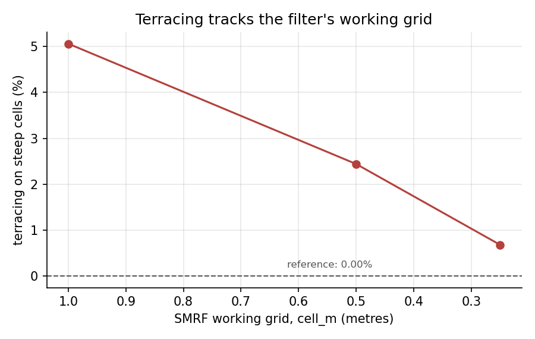
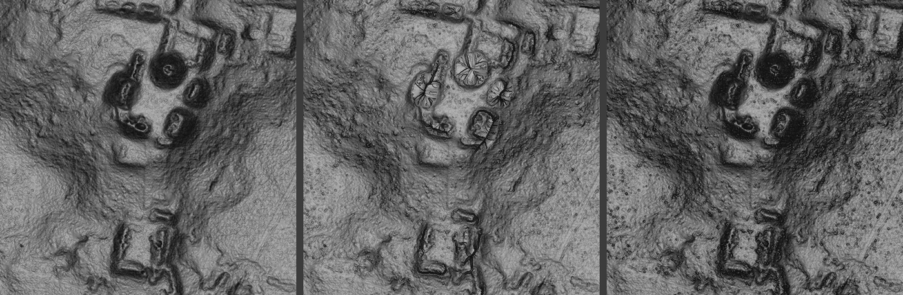

# Calibrating on the wrong ground

### Replicating a commercial lidar workflow with open tools, and finding that the test set had been selecting against the terrain that mattered

Benjamin Jay Britton, 20 September 2026

---

Replicalm reproduces the NCALM bare-earth workflow described in the Estrada-Belli
et al. 2025 supplementary material using PDAL, GDAL, NumPy and SciPy, with no
TerraScan, ArcGIS Pro, Golden Surfer or paid LAStools module. The point of the
exercise is that the published method cannot be run without those licences, so
its results cannot be reproduced or extended by anyone who lacks them.

This post is about the part of that work which was not a porting exercise. The
pipeline was tuned against reference surfaces from the original workflow, it
scored well, and it produced a visualisation with a large and obvious artifact
in it. The artifact was not in the parameters. It was in how the parameters had
been chosen.

## The workflow

Given a point cloud, produce a bare-earth raster:

1. tile at 1 km with a 10 m buffer, per the source
2. classify ground with `filters.smrf`
3. flag low outliers
4. compute height above the ground model with `filters.hag_delaunay`, apply the
   source's −0.5 m / 600 m cuts and its ±0.2 m class 8 band
5. krige onto a declared grid
6. fill enclosed holes, trim the one-sided coverage fringe, write with the
   black-means-nodata convention and a mask band

Steps 1, 4 and the export are the source's numbers unchanged. Steps 2 and 5 are
translations, because no free tool implements TerraScan's progressive TIN
densification with its four-parameter surface, and the translation is where the
interesting failure lived.

## Calibration said one thing

The harness cut a 400 m window from each of three tiles, swept classifier
settings, and scored RMSE and terrain complexity against the reference. It
chose cloth simulation (`filters.csf`, rigidness 2) over SMRF on the tile with
known structures, one ground pass instead of the source's two, and the noise
filters switched off — each by a clear margin on the score it was given.

Rendered at tile scale, that configuration produced this:


*Left: the archive G1 from the original workflow. Centre: the flat-calibrated
configuration. Right: the locked baseline. Same point cloud, same 0.5 m grid.*

The beaded necklaces along the mound flanks in the centre panel are not in the
data and not in the archive. They are runs of cells pinned to a local extreme
where the interpolator could find no ground returns nearby.

## The diagnosis went wrong twice before it went right

**First hypothesis: the kriging fallback guard.** `krige_grid` rejected any
estimate falling outside the range of its neighbours, on the stated grounds that
ordinary kriging interpolates and cannot legitimately extrapolate. That premise
is false — OK weights sum to one but are not constrained positive, and a cell
near the top of a slope should estimate above all its neighbours. The guard did
fire preferentially on steep ground (8.2% of cells above 30° against 0.17% on
the flat) and diverted them to inverse distance, which *is* a convex combination
and therefore clamps. The mechanism was right and the magnitude was not:
removing the guard moved window RMSE from 0.564 to 0.551.

**Second hypothesis: the search radius.** A ladder from 14.4 m down to 1.5 m cut
window RMSE by 4.2×, which looked decisive. It was an artifact of the scoring:
fill fraction fell from 97.4% to 85.4% across that ladder, and the cells being
dropped were the steep ones. Re-scored on a fixed cell set that every radius
could solve, radii from 3 to 14.4 m are identical to three decimals, and 1.5 m
is slightly worse.

```
radius   own fill    rmse    20-30deg  30-90deg   (same cells every row)
14.40     100.0%    0.057      0.51%     1.79%
 8.00      98.9%    0.057      0.51%     1.79%
 5.00      97.5%    0.057      0.51%     1.79%
 3.00      95.7%    0.057      0.51%     1.79%
 1.50      93.1%    0.065      1.24%     3.12%
```

**What it actually was.** The cells that failed had a median of 74 returns
within 1.5 m and *zero* classified as ground. The returns were there; the
classifier was discarding them. Ground fraction fell from 45% on flat ground to
28% above 30°, and to nil on the flanks — a rigidness-2 cloth cannot drape a
30° mound face, so the flank returns sit further below it than the threshold
allows and are never ground.

```
arm              gnd/m2  steep support   window rmse
csf_r2 (chosen)    4.16         67.8%        0.294
csf_r1             4.46         81.1%        0.242
smrf_s05           4.96        100.0%        0.049
```

Loosening the cloth helps and does not close it. The instrument was wrong.

## Why the calibration could not have found this

Error is not distributed evenly over terrain. On this tile, 97.7% of all cells
more than 0.5 m from the reference sit on slopes above 10°, which are 15.5% of
the tile.


Below 10° every configuration tried agrees to within 0.08% of cells. Above 30°
they range from 2.25% to 40.38%. Flat ground cannot distinguish them.

And the harness selected for flat ground. `best_window` picked the 400 m window
with the highest reference coverage — which finds open, fully-covered terrain by
construction. Measured after the fact:

```
tile     coverage-selected        relief-selected
         cov     steep            cov     steep
l8s431   94.9%    0.13%           92.7%    3.92%
l0s444   86.7%    0.17%           80.1%    2.93%
l0s395   97.9%    0.20%           82.0%   28.26%
l2s444   95.1%    0.00%           90.9%   11.28%
l2s443   95.2%    0.02%           87.2%    2.53%
```

Every calibration window contained between 0.00% and 0.20% steep ground. The
sweeps were not under-weighting slopes; they had none. A classifier sweep across
eight tiles that produced no clear default was measuring flat ground eight
times, where there is no default to find.

Re-run on relief-selected windows, the answer is not ambiguous:

```
arm            tiles  support   over30   terrace    rmse
smrf_1pass         6    98.1%   10.18%    2.90%   0.2258
smrf_2pass         6    98.1%   10.34%    2.87%   0.2362
csf_r2             6    79.4%   36.72%   11.96%   0.5286
source verbatim    6    98.3%   17.68%    2.98%   0.4416
```

## A second artifact, and a parameter the source could not specify

With the classifier fixed, steep faces still rendered as concentric steps.
`filters.smrf` works on its own grid, `cell`, left at 1.0 m while the output was
0.5 m. On a near-vertical trench wall a 1 m cell spans a metre of real
elevation, so the threshold admits and rejects returns in bands down the face.



Terracing — the share of steep cells whose own gradient has collapsed below a
quarter of the reference's — halves with each halving of the grid. TerraScan has
no equivalent parameter, so the source cannot specify it and the translation has
to choose. Tying it to the output cell is the choice with a measurement behind
it.



## Where it ended up

Against the reference, tile-wide, on the 12.29 M cells all configurations
deliver:

| configuration | RMSE | 20–30° | 30–90° | terracing |
|---|---|---|---|---|
| flat-calibrated | 0.3370 | 17.38% | 40.38% | 9.83% |
| SMRF, 1 pass | 0.0678 | 1.10% | 4.85% | 0.85% |
| **locked baseline** | **0.0601** | **1.01%** | **2.25%** | **0.26%** |
| archive | — | — | — | 0.00% |

Median difference from the reference is 1.5 mm. Coverage is 99.56%, unchanged
across configurations — none of the improvement is bought by dropping cells.

## Three results worth carrying elsewhere

**The variogram has no range to derive anything from.** Fitted at max-lag
windows of 5 to 80 m on ten tiles, the range tracked the window every time at
0.30–1.44× its width and the sill grew 3× to 140× without plateauing. The
`radius_from_variogram` helper was returning ~1.4 × `max_lag` and presenting it
as a measurement. The baseline sets the radius from point density instead, and
says so.

**`max_points` is the real neighbourhood control, not the radius.** At 4 ground
points per m² the 16th neighbour is within ~1.2 m, so the cap binds and 5 m and
20 m radii give identical results to four decimals. The radius acts only where
points are sparse — which is the coverage boundary, where the one-sided fringe
is one radius wide and carried a third of the tile's error budget.

**Thinning dense tiles buys provenance, not accuracy.** At 8.18 pts/m², 76% of
cells fell back to inverse distance because the 16 nearest neighbours sit within
0.8 m and the matrix loses rank. Declustering drops the fallback to 0.3% and
moves RMSE by 0.002 m. It buys a working covariance model and the right to call
the output kriged. It does not buy elevation accuracy.

## What is still open

One comparison on the trench window produced a 2× difference in RMSE and a 10×
difference in terracing that no isolated variable has yet accounted for. It was
attributed to the two-pass structure, then to the noise filters, and both
attributions were wrong — three variables differed in that comparison and it was
treated as two, twice. The remaining candidate, the SMRF `slope` term, has not
been swept on terrain where terracing is visible. The accepted output uses
`slope = tan 9° = 0.1584`, so the baseline may be correct by inheritance rather
than by measurement.

That, and four other unresolved items, are recorded in
[`docs/open_observations.md`](../open_observations.md).

## The locked baseline

| setting | value |
|---|---|
| ground filter | `filters.smrf`, one pass |
| slope | 0.1584 (tan 9°, the source's pass-1 iteration angle) |
| threshold | 0.5 m (source: 3.0 m — does not transfer) |
| working grid | 0.5 m, tied to the output cell |
| ELM | off — removed 0.00% of points on every window tested |
| statistical outlier | on — effect is tile-dependent |
| search radius | scaled to density, ceiling 20 m (the source's figure) |
| neighbours | 16 |

`config.verify_baseline()` raises if a configuration has drifted from these, so
a production run stops rather than silently producing something else.

---

## The general point

The pipeline was never badly parameterised. It was well parameterised for the
ground it was shown, and it was shown the wrong ground — because the window
selector optimised for coverage, and coverage is highest exactly where terrain
is flattest. Archaeological features are not on flat ground. The selection rule
and the target were in opposition, and nothing in the scores could reveal it,
because the scores were computed on the terrain the rule had chosen.

The fix was not a better score. It was a harder test set.
