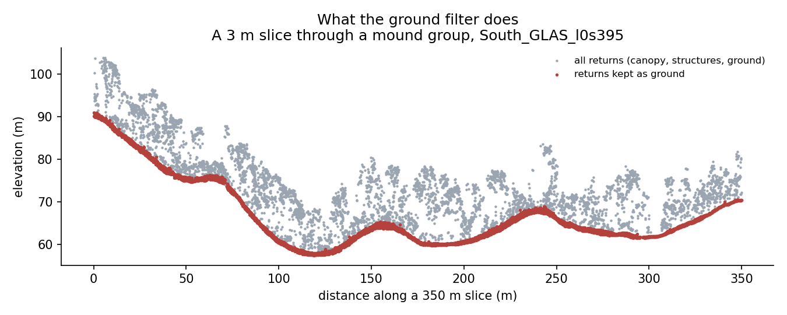
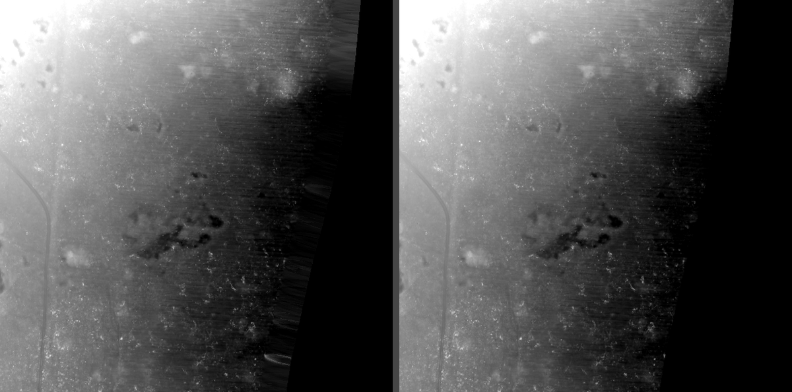
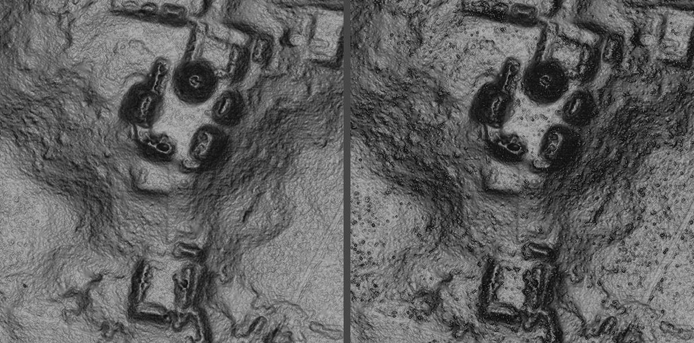

# Replicalm

*A plain-speech description of what this is, what it does, and how it relates to
the NCALM workflow described in the Estrada-Belli et al. 2025 supplementary
material.*

Benjamin Jay Britton, 2026

---

## What it is

Replicalm is a set of Python tools that turns a raw airborne lidar point cloud
into a bare-earth elevation model — a picture of the ground with the trees and
buildings taken out. It is built to follow the method that NCALM used to process
the G-LiHT surveys of the Maya lowlands, but using only software that is free
and open.

The reason for building it is simple. The published method depends on commercial
software — TerraScan for the classification, Golden Surfer for the
interpolation and rasterization. If you do not have
those licenses, you cannot reproduce the published results, and you cannot apply
the same processing to new data. Replicalm is an attempt to close that gap.

## What it does

You give it a point cloud and it gives you back a ground surface. In between it
does five things:

1. **Reads the survey.** Lidar tiles are large — a single G-LiHT tile can be two
   gigabytes. Replicalm processes a whole tile at once on a machine with the
   memory for it, and can fall back to one-kilometer blocks with a ten-meter
   overlap where memory is short. That choice changes nothing about the result;
   it only changes how the work is divided.

2. **Sorts the returns into ground and not-ground.** This is the hard part. Each
   laser pulse may bounce off a leaf, a branch, a rooftop, and finally the soil.
   The software has to decide which returns are the floor. Replicalm uses a
   filter called SMRF, which works by sliding a shape across the data and asking
   which points sit close enough to the lowest surface to be ground.

   

   *A three-meter-wide slice cut through a mound group, seen from the side. The
   gray dots are every laser return — canopy above, ground below. The red dots
   are the ones the filter decided were the floor. The whole job is drawing that
   red line correctly, including where the ground is steep.*

3. **Removes obvious errors.** A few returns land below the real ground —
   reflections, birds, noise in the sensor. These are flagged so they do not
   drag the surface down into a pit.

4. **Fills in the gaps between the ground points.** Ground returns are scattered
   irregularly; a map needs a value at every cell of a regular grid. Replicalm
   uses kriging, a statistical interpolation method, falling back to a simpler
   distance-weighted average where the mathematics becomes unstable.

5. **Tidies the edges.** Cells around the outside of the surveyed area are
   calculated from data on one side only, so they are unreliable and get
   trimmed. Small holes inside the covered area get filled. Areas with no data
   are set to black, and nothing inside the data area is allowed to be black, so
   that a hole can never be mistaken for terrain or the other way round.

   

   *The eastern edge of the flight line. On the left, the raw surface: the
   ragged comb along the boundary is cells calculated from data on one side
   only, which can be wrong by several meters. On the right, the same area after
   trimming.*

6. **Makes the picture.** A bare-earth elevation model is a grid of numbers. What
   an archaeologist actually reads is a shaded image, and the one used here is
   G1 — four relief visualizations blended together, the recipe published as
   Table 3 of Britton et al. 2025. Replicalm calls that recipe rather than
   copying it, so there is only one definition of it and this software cannot
   drift away from it.

## Three ways to run it

The same pipeline runs in three forms. The application offers all three and
runs Clear unless told otherwise.

**Baseline** follows the published method as closely as the translation allows.
It is what everything else is measured against, and it stays selectable because
Clear's threshold was fitted on one campaign's labels: on terrain where that has
not been checked, Baseline is the setting that assumes nothing.

**Clear** adds one step. Some laser pulses stop on low vegetation — scrub,
brush, a root mass — instead of reaching the soil, and the ground filter accepts
them. In the elevation model they become small bumps a few centimeters high, and
in the shaded image they appear as a fine speckle across otherwise flat ground:
clutter that an archaeologist has to learn to discount. Clear removes returns
that stand more than 20 cm above the ground immediately around them, which
catches most of that vegetation. It also removes some genuine ground with it, so
the edges of platforms come out very slightly softer.

**Deep** takes Clear and sets the map's cell size from the survey's own point
spacing instead of fixing it in advance. Where ground returns average one every
half meter, a third-of-a-meter cell resolves what the data holds; a sparser
survey gets a coarser grid and a denser one a finer grid. Deep is aimed at
getting the most out of a given point cloud rather than at matching what the
commercial workflow produced — a different goal, not a better score at the same
one.

*The Pixoyal group. From left: the original commercial workflow; Replicalm's
baseline, where the speckle on the open ground is vegetation the filter let
through; Clear, with it removed; and Deep, on a finer grid. The four have been
matched for overall brightness so the comparison is about what they show rather
than how light they are.*

## What you get

Two products, from one run:

**The elevation model** — a single-band GeoTIFF of ground heights in meters.
Zero means no data, and nothing inside the surveyed area is ever exactly zero,
so a hole can never be mistaken for terrain. Beside it, a small JSON file
recording the settings used, how many cells were interpolated across gaps, and
how far the edge was trimmed.

It used to carry a second layer marking where the data was real. That layer was
removed: it repeated what the elevations already said, and a second layer is
quietly dropped by many format conversions, which is the sort of silent loss the
whole black-means-nothing convention exists to prevent.

**The G1 image** — a three-channel picture of the same ground, plus the five
individual visualizations it is blended from (sky-view factor, positive
openness, slope, multi-directional hillshade and the archaeological VAT blend).
This step is optional. It needs one extra component, the Relief Visualization
Toolbox, and a run that only wants elevations does not have to install it.

## The tools it uses

Everything is free and open:

- **PDAL** reads point clouds and runs the ground filter.
- **GDAL** reads and writes the map files and handles coordinate systems.
- **NumPy and SciPy** do the kriging and the arithmetic.
- **Relief Visualization Toolbox** produces the shading the G1 image is blended
  from. Apache-licensed, from the Slovenian Academy of Sciences and the
  University of Ljubljana. Needed only for the picture, not for the elevations.
- **QGIS and CloudCompare** are useful for looking at results but are not
  required by the pipeline.

## Running it

Three ways, all doing the same work:

- **A command line**, for scripting a survey: point it at a cloud, name an
  output folder, add `--g1` if the image is wanted.
- **A Python call**, for building it into something larger.
- **A desktop application** — planned, and partly built. It is a small window:
  choose a point cloud, choose an output folder, set the cell size, tick a box
  for the image, press Run. A progress log shows each stage as it happens,
  because a full tile takes minutes and a window that may or may not be working
  is worse than a slow one that says what it is doing.

The desktop version is packaged as an installer carrying its own copy of Python
and the geospatial libraries, so nothing needs to be installed or configured
first and it cannot collide with other software already on the machine. That
costs about four gigabytes on disk and buys a program that runs where nothing
has been set up. The packaged build has been tested end to end: it processes a
tile and writes a correctly projected elevation model using only its own bundled
components.

Nothing in the chain needs TerraScan or Surfer.

## How it compares to the published method

### What is the same

The overall shape of the workflow is the same, and several numbers are taken
directly from the source and not changed:

- height-above-ground limits of −0.5 m and 600 m
- the near-ground band of ±0.2 m, written to class 8
- exporting only the ground and near-ground classes
- LAS version 1.2 output
- a twenty-meter kriging search radius as the maximum

### What is similar but not identical

**The ground filter.** This is the largest difference and it cannot be avoided.
The published method uses TerraScan's "Classify Ground", which builds a
triangulated surface and grows it upward — an approach with four settings:
window size, maximum terrain angle, iteration angle and iteration distance. No
free tool implements that algorithm with those settings. Replicalm uses SMRF
instead, which does the same job by different means and has different knobs.

The settings were translated by reasoning about what each one controls. The
source's 9° iteration angle becomes a slope tolerance of 0.1584, which is the
tangent of 9°. That is a defensible translation, not an equivalence, and the
result was checked against reference surfaces produced by the original workflow
rather than assumed to be right.

**Interpolation.** Both krige. The published method uses Golden Surfer;
Replicalm uses its own implementation. The search radius is the source's
twenty meters as an upper limit, but it is scaled down where the points are
densely packed, because a wide search on dense data makes the mathematics
unstable.

### What is different

**Two passes became one.** The source runs its ground classification twice, the
second pass refining the first. SMRF has no refining mode — each run starts
over — so a second pass simply redoes the work with a steeper tolerance.
Measured across seven areas, running it twice changed nothing and doubled the
time, so Replicalm runs one pass. This is a real departure from the source and
is recorded as such.

**The elevation tolerance is tighter.** The source allows a point to sit three
meters below the surface and still count as ground. Carried across directly,
that setting lets in almost anything: it produced four times the error of a
half-meter tolerance. Replicalm uses 0.5 m. The source's figure describes
TerraScan's behavior, not SMRF's.

**There is one setting the source could not have.** SMRF works on its own
internal grid, and TerraScan has no equivalent. Left at one meter while
producing a half-meter map, it turns steep slopes into staircases. Tying it to
the output cell size removes most of that.

**The output grid is declared rather than derived.** The original products have
cells of 0.500042 by 0.499988 meters on origins that are multiples of nothing,
which means neighboring tiles do not line up without resampling. Replicalm puts
cell edges on whole multiples of the cell size, so tiles join exactly and a
re-run reproduces the previous result. For direct comparison against an original
product, it can adopt that product's grid instead.

**Noise removal is reduced.** The source's workflow includes a low-point filter.
Tested here, one of the two filters available removed no points at all, on flat
and steep ground alike, so it is switched off by default with that measurement
recorded. The other removes a fraction of a percent and its effect varies by
tile.

## How well it works

*The same ground, same point cloud, same visualization recipe. On the left, the
surface from the original commercial workflow. On the right, Replicalm.*

Tested on South_GLAS_l0s395, a tile with known structures, against the
reference surface from the original workflow:

- Half the cells agree to within 1.5 millimeters.
- Across the whole tile the root-mean-square difference is 6 centimeters.
- On flat ground, fewer than one cell in ten thousand differs by more than half
  a meter.
- On slopes steeper than thirty degrees, about one cell in forty-five does.
- Platforms, plazas, range structures and looter trenches read clearly in the
  resulting visualization.

The remaining disagreement is almost entirely on steep ground. Below ten
degrees of slope the two surfaces are effectively the same; above thirty degrees
they are not. Slopes above ten degrees make up about 15% of this tile but carry
about 98% of the large differences.

## What is not settled

Three things are recorded in `docs/open_observations.md` rather than glossed:

- One comparison on a steep window produced a much larger difference than any
  other setting has explained. The cause was attributed twice and both
  attributions turned out to be wrong. One candidate remains untested.
- The outlier filter helps on one tile and hurts on another, and it is not known
  what distinguishes them.
- Results obtained before 20 September 2026 were measured on sample areas that
  turned out to contain almost no steep ground, which is where the differences
  live. Those results should be treated as untested rather than as established.

## The settings, as locked on 20 September 2026

| setting | value |
|---|---|
| ground filter | SMRF, one pass |
| slope tolerance | 0.1584 (tangent of 9°) |
| elevation tolerance | 0.5 m |
| filter working grid | 0.5 m |
| low-point filter (ELM) | off — removed nothing when tested |
| outlier filter | on — effect varies by tile |
| kriging search radius | scaled to point density, never above 20 m |
| neighbors per cell | 16 |

These are recorded in code as well as in this table, and the software will
refuse a production run if the configuration has drifted from them.
