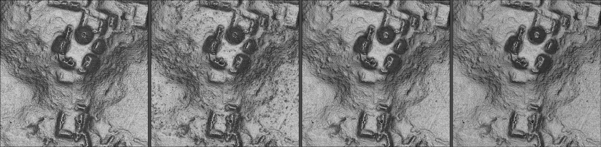

# Replicalm

### What it is, why it exists, and how it compares to TerraScan and Golden Surfer at reproducing the NCALM method

Benjamin Jay Britton, September 2026

---

## What it is

Replicalm is a software tool that turns raw airborne lidar point clouds into
bare-earth elevation models and archaeological relief visualizations. It
reproduces the processing workflow that NCALM used on the G-LiHT surveys of the
Maya lowlands, as documented in the supplementary materials of Estrada-Belli et
al. 2025.

It runs on free and open software throughout: PDAL for point-cloud handling and
ground classification, GDAL for coordinate systems and raster output, NumPy and
SciPy for the interpolation, and the Relief Visualization Toolbox for the
optional image step. It is MIT licensed.

## Why it exists

The published method depends on two commercial products: TerraScan for ground
classification, and Golden Software Surfer for interpolation and rasterization.
Together these represent several thousand dollars of licensing before a single
tile is processed.

That creates two problems for the field. Published results cannot be
independently reproduced by anyone without those licenses — which is most
researchers, most students, and most institutions outside well-funded programs.
And the method cannot be applied to new surveys by those same people, so the
data accumulating from lidar campaigns can only be processed by those who can
pay to process it.

Replicalm closes that gap. The method is the same method; the tools underneath
it are ones anyone can install.

## What it is useful for

The immediate use is processing G-LiHT and comparable airborne lidar over
archaeological landscapes: producing a ground surface with vegetation removed,
and from it the shaded relief images in which platforms, plazas, causeways,
terraces and looter trenches become legible.

Beyond that, three things make it useful as infrastructure rather than as a
one-off script:

**Every run records its own settings.** A configuration file is written beside
each output, so any raster can be traced back to the parameters that produced
it. The tool refuses to run silently under settings that differ from the
validated baseline — it says so.

**The output grid is declared rather than derived.** Neighboring tiles land on
the same lattice and mosaic without resampling, and rerunning reproduces the
previous result exactly.

**Parameters are measured, not inherited.** Each setting in the baseline carries
the measurement that chose it, recorded in the code beside the value.

## How it works

Given a point cloud, five stages:

1. **Classify ground.** Decide which returns are the soil and which are canopy,
   structures or brush. This is the hard part and the part that determines
   everything after it.
2. **Remove outliers.** Flag returns that cannot be ground.
3. **Measure height above ground** and apply the source method's cuts, including
   its near-ground class band.
4. **Interpolate** the scattered ground returns onto a regular grid by ordinary
   kriging.
5. **Finish the raster** — fill enclosed gaps, trim the unreliable fringe where
   cells were calculated from data on one side only, and write it so that no
   data is unambiguous.

An optional sixth stage produces the G1 relief composite from the finished
surface.

## Three configurations

The same pipeline runs in three forms, which differ in how hard they work at
removing what is not ground and at matching the grid to the data.

**Baseline** reproduces the source method as closely as the translation allows.
It is the configuration against which everything else is measured, and it is
what the software runs unless told otherwise.

**Clear** adds one step: it removes ground returns that stand more than 0.20 m
above the local ground surface. These are overwhelmingly low vegetation — scrub,
brush, root mass — that stopped the laser pulse before it reached the soil. In
the baseline they survive into the elevation model and appear in the image as a
fine speckle across otherwise flat ground.

**Deep** takes Clear and adds a cell size derived from the survey's own point
density rather than fixed in advance. Where ground returns average one every
0.46 m, as they do here, a 0.33 m cell resolves what the data contains; on a
sparser survey the same rule produces a coarser grid, and on a denser one a
finer grid. Deep is aimed at getting the most out of a given point cloud rather
than at matching what the commercial workflow produced.

---

## How it compares to TerraScan and Golden Surfer

### What cannot be ported, only translated

TerraScan's "Classify Ground" implements progressive TIN densification after
Axelsson (2000). The source method drives it with four parameters: a 70 m
window, an 88° maximum terrain angle, iteration angles of 9° and 12° on two
successive passes, and a 3 m iteration distance.

No free tool implements that algorithm with that parameter surface. PDAL offers
SMRF (Pingel et al. 2013), a morphological filter; PMF (Zhang et al. 2003); and
CSF (Zhang et al. 2016), a cloth simulation. None of them has a terrain angle or
an iteration angle. ArcGIS Pro's equivalent offers three presets and exposes
none of the four.

So the classification stage is a translation, not a port, and any claim that it
has been replicated exactly would be false. Angles were converted to slope
tolerances by taking their tangent — tan 9° = 0.1584 — and the translation was
then checked against reference surfaces produced by the original workflow rather
than assumed correct.

Golden Surfer's kriging is likewise proprietary. The source specifies a 20 m
search radius and says nothing about the variogram model, its parameters, or the
maximum number of points per solve. Those had to be chosen and are recorded.

### What is carried over unchanged

The height-above-ground cuts at −0.5 m and 600 m, the ±0.2 m near-ground class 8
band, ground-only export, LAS 1.2 output, and a 20 m kriging search radius as
the maximum.

*The Pixoyal group on South_GLAS_l0s395, same point cloud and same visualization
recipe throughout. From left: the original TerraScan and Surfer workflow;
Replicalm's baseline, where the speckle on the plaza floors is residual low
vegetation the ground filter accepted; `Clear`, with that vegetation removed;
and `Deep`, which adds a cell size derived from the measured point density. The
four panels have been tone-matched to a common median, because the
visualization recipe normalizes each raster by its own extremes and the
untreated panels differ in overall brightness for reasons that have nothing to
do with the surfaces.*

### How closely the output agrees

Measured on `South_GLAS_l0s395`, a tile containing known structures, against the
reference surface produced by the original commercial workflow, over the 12.29
million cells both deliver:

| measure | value |
|---|---|
| median difference | 1.5 mm |
| RMSE, whole tile | 0.0601 m |
| cells more than 0.5 m apart, below 5° slope | 0.09% |
| between 5° and 10° | 0.17% |
| between 10° and 20° | 0.39% |
| between 20° and 30° | 1.01% |
| above 30° | 2.25% |
| coverage delivered | 99.56% |

Half the surface agrees to within a millimeter and a half. The disagreement is
concentrated almost entirely on steep ground: 97.7% of all error above half a
meter sits on slopes steeper than 10°, which are 15.5% of the tile.

### Where the two approaches genuinely differ

**Ground classification is where the real difference lies.** TerraScan rejects
low vegetation more completely than a translated SMRF pass does. Comparing
against TerraScan's own classification, which the delivered clouds carry, 3.88%
of the returns Replicalm calls ground were explicitly rejected by the original
workflow — and at the cells where that shows up visually as speckle on flat
ground, the figure is 12.2% against 0.8% on clean ground.

Replicalm's `Clear` rule recovers 92.5% of that without TerraScan, by demoting
returns that stand more than 0.20 m above the local ground floor. It removes
17.75% of ground returns to do what TerraScan does by removing 3.88%, so it
takes genuine returns with the clutter, and platform edges come out slightly
softer as a result.

`Deep` uses the same classification and differs downstream, in the grid. On the
measures that do not reference the commercial output, the three configurations
separate like this:

| | baseline | Clear | Deep |
|---|---:|---:|---:|
| predicts held-out ground returns (MAE) | 0.0512 m | 0.0439 m | 0.0439 m |
| returns left below the surface | 8.11% | 4.80% | 2.27% |
| rasterized fold residual, median | 0.0872 m | 0.0803 m | **0.0787 m** |
| output grid | 0.50 m | 0.50 m | 0.33 m |

Two of those rows need reading carefully. The first is identical for Clear and
Deep because that test predicts at point locations and never touches the raster,
so it cannot see cell size at all. The second improves partly for a reason
unrelated to quality: a coarser cell averages over more ground, so returns at the
low end of a cell fall beneath its single value.

The third row is the one with the grid inside the measurement — whole blocks of
returns withheld, the surface built without them, then sampled where those
returns actually are. By that measure Deep is **2.0% better than Clear**, which
is real and small. Its larger practical benefit is that slope and sky-view
factor are computed on a finer grid, so breaklines render without stair-stepping
at cell boundaries.

**Interpolation differs in how the neighborhood is chosen.** The source fixes
the search radius at 20 m. Replicalm scales it to the measured point density,
with 20 m as the ceiling, because a fixed radius means different things at
different densities — at high density it packs the neighborhood so tightly that
the kriging system loses rank.

**The output grid differs by design.** The reference products have cells of
0.500042 × 0.499988 m on origins that are multiples of nothing, so neighboring
tiles do not align without resampling. Replicalm puts cell edges on whole
multiples of the cell size. It also derives the cell size from measured ground
density rather than fixing it, since a survey at one return per square meter
cannot support a 0.5 m raster and one at sixteen is wasted on it.

**Tiling differs for reasons that are not methodological.** The source works in
1 km tiles because a whole transect will not fit in memory on modest hardware.
Replicalm's interpolation is internally chunked, so it processes whole extents
by default, with tiling available where classification memory still demands it.

### Comparing Replicalm with the commercial workflow

This is worth careful consideration, because the two are not aimed at the same
thing and a single verdict would misrepresent both.

**On elevation agreement over ordinary terrain the two are equivalent.** The
median difference is smaller than the sensor's own precision.

**On steep ground they differ**, and the difference is one of approach. The
commercial workflow produces a smoother surface there. Replicalm's baseline
carries more texture, some of which is real micro-relief and some of which is
residual vegetation. `Clear` removes the vegetation and keeps most of the
micro-relief.

**`Deep` optimizes for something different, and is therefore not on the same
scale.** Baseline and `Clear` are aimed at replication: they are measured
against the commercial output and judged by how closely they match it. `Deep` is
aimed at getting the most out of the point cloud, and is measured against the
returns themselves — how well the surface predicts measurements it was not built
from, and whether it leaves returns stranded beneath it.

Those are different objectives, and a configuration optimized for one will score
differently under the other by construction. A surface tuned to the point cloud
may well diverge further from the commercial output, and that divergence is not
evidence of error in either direction. Which of the two is the better
representation of the ground cannot be settled by comparing them to each other.
It requires ground truth — surveyed control points, or excavated profiles —
which neither workflow has here.

What can be said now is narrower and worth stating plainly. On the measures that
reference only the point cloud, `Clear` predicts held-out ground returns 13%
more accurately than the baseline and leaves roughly half as many returns
beneath the surface. `Deep` matches `Clear` on prediction and improves the
rasterized fold residual by a further 2.0% while rendering on a finer grid. All
of these are early results from a single tile.

**On reproducibility Replicalm is better, and not marginally.** Settings are
recorded per run, the grid is deterministic, and a configuration that has
drifted from the validated baseline stops the run rather than quietly producing
something different.

**On cost the comparison is not close.**

## Status

The processing pipeline is complete and validated.

**Baseline** is the locked configuration. Every parameter in it carries the
measurement that chose it, and the software refuses to run silently under
settings that differ from it.

**Clear** is validated on windows it was not developed against, and is available
as a setting rather than as the default. Making it the default is a change to
the locked baseline, which is a decision to be taken deliberately.

**Deep** is an early result. It has been built and measured on one window of one
tile, and its cell-size rule rests on a single density measurement. That the
rule should track point spacing is physically sensible and one measurement is
not a law; a survey of markedly different density should be measured before the
rule is trusted on it.

A Windows installer is built: `Replicalm-1.0.0-setup.exe`, 1.15 GB, about 4 GB
installed. It carries its own copies of Python, PDAL, GDAL and PROJ, so nothing
needs to be installed or configured on the target machine first and it cannot
collide with software already there. The staged build it wraps has been tested
end to end — it processes a tile and writes a correctly projected elevation
model using only its own bundled components. The installation sequence itself
has not yet been exercised on a second machine.

---

— Benjamin Jay Britton, 2026
